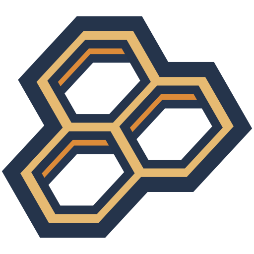

    

**Wax** is a Rust library that provides opinionated and portable [globs][glob]
that can be matched against file paths and directory trees. Globs use a familiar
syntax and support expressive features with semantics that emphasize component
boundaries.

!!! warning
    Wax is under active development and its features and glob expression syntax
    may change.

Unlike many other tools, globs in Wax are completely distinct from paths and are
designed for portability (that is, not only is the code for Wax portable, so too
are glob expressions). While globs represent regular patterns, they are
typically designed specifically for file paths and Wax incorporates this into
the design of expressions.

For more about the syntax and features of glob expressions and how to use them,
see the [user guide](user-guide/syntax.md). To learn more about how to write
code against Wax, see the [code guide](code-guide/glob.md) and the [API
documentation][api]. For contributing changes to Wax, see the [contributor
guide](contributor-guide/tools-and-hosting.md).

[api]: api/wax/index.html
[crate]: https://crates.io/crates/wax
[glob]: https://en.wikipedia.org/wiki/Glob_(programming)
[repository]: https://github.com/olson-sean-k/wax
